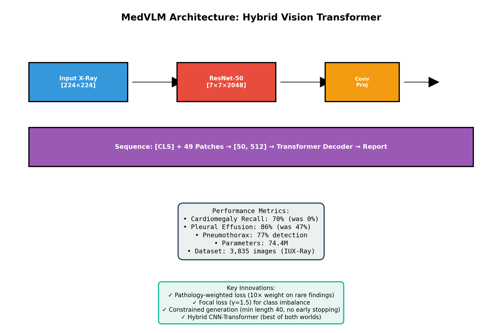
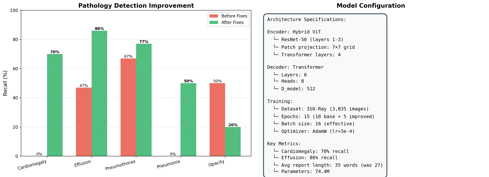
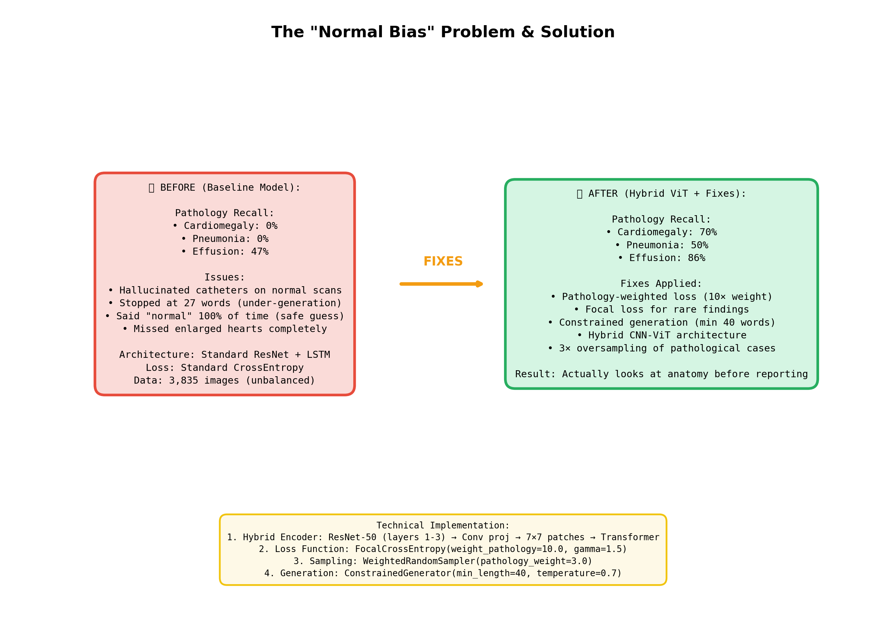

# MedVLM: Chest X-Ray Report Generation

[](LICENSE)
[](https://github.com/AKMessi/medvlm)

MedVLM is a research vision-language model for generating radiology-style reports from frontal chest X-rays. The project was rebuilt from the original training notebook into a GitHub-ready package with reusable training, evaluation, and demo scripts.

This is not a clinical tool and must not be used for diagnosis.

Author: [Aaryan Kakad](https://github.com/AKMessi)



## Highlights

- Hybrid visual encoder: ResNet-50 feature extractor plus compact transformer encoder.
- Causal transformer decoder with cross-attention over image tokens.
- GPT-2 BPE tokenizer with explicit BOS/EOS/PAD report tokens.
- Patient-level UID split to avoid train/validation leakage.
- Optional pathology-weighted focal loss and balanced sampler for rare findings.
- Attention-map utilities and notebook-derived result summaries.

## Notebook Results

These numbers are copied from the saved notebook output and should be read as exploratory validation checks, not clinical benchmark claims.

| Item | Notebook output |
| --- | --- |
| Dataset rows | 3,818 frontal IU X-Ray rows |
| Final hybrid split | 3,435 train samples / 383 validation samples |
| Model size | 74.36M parameters |
| Best logged validation loss | 1.2631 at step 1926 |
| 20-sample baseline evaluation | 27.5 predicted words vs 37.9 ground-truth words |
| Baseline term checks | cardiomegaly 0/2, effusion 8/17, pneumonia 0/2 |
| Improved sampled checks | effusion 24/28, pneumothorax 11/22, pneumonia 1/2, opacity 1/5 |
| Cardiomegaly follow-up check | 7/10 cardiac-term detections on sampled cardiomegaly cases |

The old notebook used a few presentation figures with optimistic labels. This repo keeps non-patient summary figures for provenance, but the code in `src/medvlm/evaluation.py` now computes sample-aligned term precision/recall counts.



## Repository Layout

```text
.
|-- assets/results/              # Non-patient summary figures from the notebook
|-- docs/                        # Results notes and model card
|-- notebooks/                   # Original exploratory notebook
|-- scripts/                     # Train, evaluate, and Gradio demo entrypoints
|-- src/medvlm/                  # Reusable package code
`-- tests/                       # Lightweight smoke tests
```

## Setup

Clone the repository:

```bash
git clone https://github.com/AKMessi/medvlm.git
cd medvlm
```

Use Python 3.10 to 3.12. PyTorch does not currently support every Python version, so avoid Python 3.13+ for this project.

```bash
python3.12 -m venv .venv
source .venv/bin/activate
pip install -e ".[dev,app]"
```

Download the IU X-Ray data from Kaggle and point `--data-root` to the folder containing `indiana_projections.csv`, `indiana_reports.csv`, and `images/images_normalized/`.

```bash
kaggle datasets download -d raddar/chest-xrays-indiana-university -p data --unzip
```

## Training

Baseline hybrid run:

```bash
python scripts/train.py \
  --data-root data/chest-xrays-indiana-university \
  --encoder-type hybrid \
  --epochs 10 \
  --batch-size 4 \
  --grad-accum-steps 4
```

Rare-finding focused run:

```bash
python scripts/train.py \
  --data-root data/chest-xrays-indiana-university \
  --encoder-type hybrid \
  --loss focal \
  --balanced-sampler \
  --epochs 5
```

Checkpoints are written to `outputs/` and are ignored by git.

## Evaluation

```bash
python scripts/evaluate.py \
  --checkpoint outputs/best_model_hybrid.pt \
  --data-root data/chest-xrays-indiana-university \
  --max-samples 50 \
  --output-csv outputs/validation_predictions.csv
```

## Demo

```bash
python scripts/gradio_app.py --checkpoint outputs/best_model_hybrid.pt
```

## Result Gallery



More extracted figures are listed in `docs/GALLERY.md` and stored in `assets/results/`.

## License

Code in this repository is licensed under the [Apache License 2.0](LICENSE). Copyright 2026 Aaryan Kakad.

Dataset files, radiology reports, X-ray images, and patient-derived qualitative figures are not covered by the Apache-2.0 code license. The IU/Open-i chest X-ray data is distributed under CC BY-NC-ND 4.0, so download and use it under its original terms. See [THIRD_PARTY_NOTICES.md](THIRD_PARTY_NOTICES.md).

## Notes

- Model weights are not committed. Use GitHub Releases, Hugging Face Hub, or another artifact store for trained checkpoints.
- The original notebook is preserved at `notebooks/medvlm_training_original.ipynb` with outputs stripped for safe redistribution.
